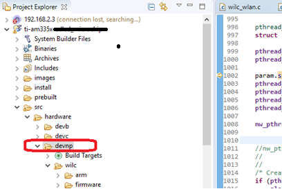
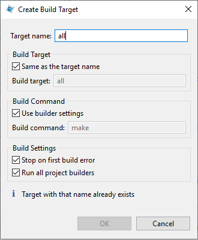
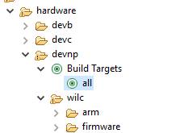
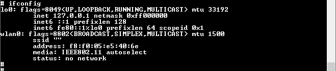

This page has a demo/example for wilc1000. Please click [here](https://github.com/search?q=topic:wilc1000+org:MicrochipTech) for more demos/examples

# WILC1000 QNX Driver

This is the WILC1000 QNX Driver source code

## Description

This reprosoitry is WILC1000 QNX Driver source code. The code is refer to the WILC1000 official driver [release v 15.3.1](https://github.com/linux4wilc/driver/releases/tag/wilc_linux_15_3_1) 
This driver is working with TI AM335X SDIO driver. If you need to make the driver work on your platform other than AM335X, you need to port the SDIO driver to WILC1000 driver code. The SDIO porting layer will be introduced in below sections.


## SDIO porting

The SDIO driver related code is located at directory **/wilc/sdiodi**  
And the SDIO hardware dependent code is located at directory **/wilc/sdiodi/am335x**  for AM335X SDIO pheripial.  
If you are not using AM335X MPU, you can make refernece the code in **/wilc/sdiodi/am335x** and port your SDIO pheripial code like file **/wilc/sdiodi/am335x/sim_omap3.c** and **/wilc/sdiodi/am335x/sim_bs_am335x.c**  
There is a set of function pointer in QNX SDIO structure **sdio_ext_t**, you can port your SDIO driver code to these function pointers to make the SDIO work porperly.  

The function pointer of the structure **sdio_ext_t** is shown below, with comments to introduce the usage

```
    	void			(*hdl_init)(void *);	// something has to be initialized in the SDIO event handler

	int			(*detect)(void *);		// card status
	int			(*powerup)(void *);		// powerup MMC/SD HC
	int			(*powerdown)(void *);	// powerdown MMC/SD HC

	int			(*command)(void *, sdio_cmd_t *);		// send command
	int			(*command_done)(void *, sdio_cmd_t *);	// command done
	int			(*ienable)(void *, int irq, int);			// enable/disable interrupt
	int			(*ivalidate)(void *, int irq, int busy);		// validate interrupt
	int			(*iprocess)(void *, sdio_cmd_t *cmd);	// process interrupt
	int			(*setup_dma)(void *, paddr_t, int, int);	// DMA read/write setup
	int			(*dma_done)(void *, int dir);			// DMA xfer complete
	int			(*setup_pio)(void *, char *buf, int len, int dir);	// PIO read/write setup
	int			(*pio_done)(void *, char *buf, int len, int dir);	// complete
	int			(*block_size)(void *, int blksz);		// set block size
	int			(*bus_speed)(void *, int *speed);		// set bus speed, in HZ
	int			(*bus_width)(void *, uint8_t width);	// set bus_width, 1 or 4

	int			(*shutdown)(void *);		// Shutdown
	int			(*get_mask)(void *);		// Get current SDIO interrupt mask status
```

## GPIO Configuration
RESETN pin and CHIP_EN pin are used to reset and enable the Wi-Fi module. There is a power-up sequence for these 2 pins.  
The details can be checked in [ATWILC1000-MR110xB Datasheet](https://ww1.microchip.com/downloads/en/DeviceDoc/70005326D.pdf), page 18.  
The power-up sequence setting of these two pins is need to be implemented in the function **void wilc_wlan_power_on_sequence(struct wilc_dev *wilc)**, located in **/wilc/wilc_sdio.c**


## WILC Firmware
This driver is work with WILC firmware [ver 15.3.1](https://github.com/linux4wilc/firmware/releases/tag/wilc_linux_15_3_1)  
You can download the firmware and put **wilc1000_wifi_firmware.bin** to **/lib/firmware/wilc/** in your test platform

## Build the driver

1.  Download the code in this reprosoity 
2.  Put the code to the folder **\src\hardware\devnp** of your QNX source tree
3.  Launch QNX Momentics IDE
4.  Right click **devnp** folder in the IDE
    <p align="center">
    
    </p
5.  Click **Build Target** -> **Create**, Input **all** in Target Name
    <p align="center">
    
    </p> 
    
6.  Double click **Build Target -> all** icon to build the driver
    <p align="center">
    
    </p> 
    
7.  The compiled WiFi driver(devnp-wilc-am335x.so) can be found at directory **\src\hardware\devnp\wilc\arm\am335.dll.le.v7**  
You need to put this driver file in the platform and perform tests.
    


## Run and Test the driver
Type below command to install network stack and driver:
```
io-pkt-v6-hc -ptcpip stacksize=48000,mclbytes=4096
```
```
mount -Tio-pkt -o deviceindex=0,p0mode=rmii devnp-wilc-am335x.so
```
After install the network stack and drvier, type **ifconfig** command, **wlan0** interface is shown as below:
<p align="center">

</p> 


To test the driver, you can use wpa_supplicant and wpa_cli to configure the wifi driver to connect to an AP

wpa_supplicant is worked to be a "daemon" program that runs in the background and acts as the backend component controlling the wireless connection
```
wpa_supplicant -Dbsd -iwlan0 -c /etc/wpa_supplicant.conf -dd &
```
wpa_cli is a frontend program for interacting with wpa_supplicant. Below command is an example to connect to an open mode AP
```
wpa_cli -i wlan0 add_network
wpa_cli -i wlan0 set_network 0 ssid '"TestAP"'
wpa_cli -i wlan0 set_network 0 key_mgmt NONE
wpa_cli -i wlan0 select_network 0

```
Below command is an example to connect to a Secure AP (WPA-PSK)
```
wpa_cli -i wlan0 add_network
wpa_cli -i wlan0 set_network 0 ssid '"TestAP"'
wpa_cli -i wlan0 set_network 0 key_mgm WPA-PSK
wpa_cli -i wlan0 set_network 0 psk '"12345678"'
wpa_cli -i wlan0 select_network 0
```
## Limitation

This driver do not include below features
1. Soft AP mode
2. WEP Security mode 
3. SDIO DMA
